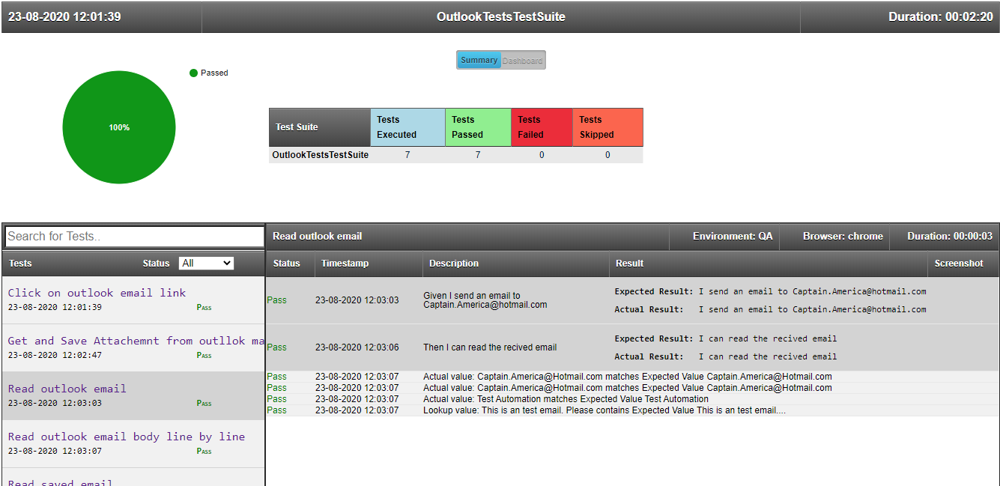

# Selenium-Outlook-Tests
# Selenium-C#-Specflow-Outlook-Tests
UI Tests using Selenium, C#, Specflow and Outlook

### Usage
Install-Package Test.Automation.Framework -Version 1.0.0.5

### Interesting stuff: Scenario execution [HTML Reports](https://github.com/SandeepDhamale19/Selenium-Outlook-Tests/tree/master/TestAutomation.OutlookTests/TestAutomation.OutlookTests/Results)
##### A. Test Suites: Summary [All passed]
 <kbd></kbd>

 
